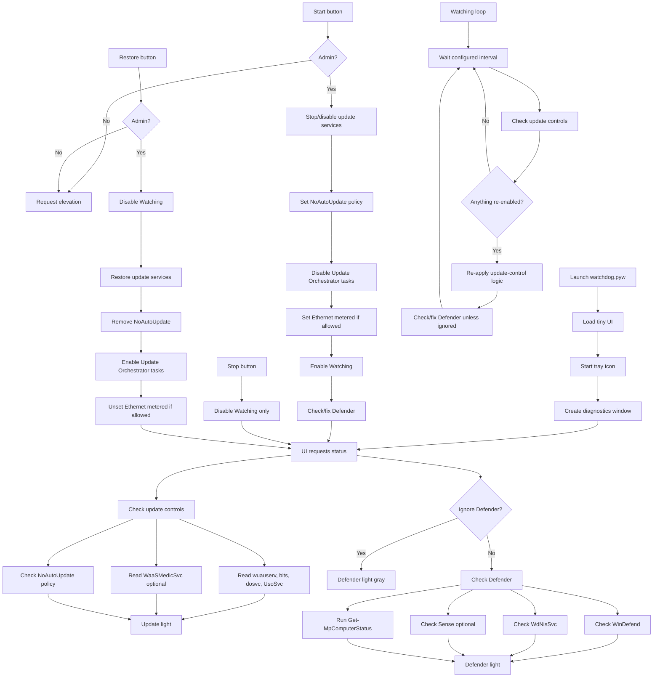

<div align="center"><h1>Windows Update Watchdog</h1>

<br><br>
<div align="center"><b>Current Version:</b> 1.2.1 </div><br>

A tiny Windows 10/11 administration utility that watches Windows Update controls
while keeping Microsoft Defender visible, repairable, and enabled.

The app is intentionally small: a compact window, tray icon, update/Defender
status lights, and a diagnostics panel for checking what the watchdog is doing.

---

## Project purpose

I made this because I did not want Copilot embedded in my operating system, and
neither should you.

This was my refusal to install.<br><br>

<div align="center"></div><br>

A few days after creation, I watched Windows push 20+ OTA updates to force any
non-upgraded Windows 11 machine to have no option but to accept the feature
update. Good things do not come by forcing them like this.

Take control of your PC.

<div align="center">
</div><br>


> This program is not recommended for everyone. Please do your own research on
> whether you absolutely need to disable Windows updates.

---

## Compatibility

| System | Status |
|---|---|
| Windows 11 | Primary target |
| Windows 10 | Legacy compatible |

Windows 10 is kept compatible where the same services, policies, and scheduled
task paths exist.

---

## What it does

- Shows update-control status with a green/red light.
- Shows Defender status with a green/red/gray light.
- Stops and disables targeted Windows Update services.
- Applies a Windows Update policy block.
- Disables Update Orchestrator scheduled tasks.
- Optionally marks Ethernet as metered.
- Keeps checking controls while `Watching` is enabled.
- Re-applies update-control logic if Windows turns services back on.
- Checks Microsoft Defender service and protection state.
- Repairs targeted Defender policy/service issues.
- Minimizes to the system tray and keeps watching in the background.
- Provides a diagnostics/settings window with individual service lights and an
  activity console.

---

## What it is not

This is not antivirus software.

This is not a replacement for Microsoft Defender.

This is not recommended for normal users who do not understand the security
tradeoffs of disabling operating system updates.

The goal is local control over Windows Update behavior while making sure
Defender stays visible, enabled, and repairable.

---

## Files

| File | Purpose |
|---|---|
| `watchdog.pyw` | Main Python tray app and Windows control logic |
| `ui.html` | Tiny main interface |
| `status.html` | Diagnostics/settings window |
| `assets/app_icon.ico` | App, titlebar, taskbar, and EXE icon |
| `version_info.txt` | Windows EXE metadata for PyInstaller builds |
| `README.md` | Project documentation |

---

## Requirements

```cmd
python -m pip install pywebview pystray pillow
```

Administrator rights are required for service changes, registry policy changes,
scheduled task changes, metered network changes, and Defender repair actions.

---

## How to run

```cmd
python main.pyw
```

The app opens a tiny window and also runs a tray icon.

Closing the window with `X` hides it to the tray. The app keeps running in the
background. Right-click the tray icon for:

```text
Open
Exit
```

Use `Exit` to fully close the process.

---

## Main controls

| Control | Function |
|---|---|
| `Start` | Applies update-control logic, checks/fixes Defender, then enables watching |
| `Stop` | Stops the watching loop without restoring update settings |
| `Restore` | Stops watching and attempts to restore Windows Update behavior |
| Gear icon | Opens diagnostics/settings |
| `?` | Opens About |

When `Watching: enabled`, the app periodically checks whether Windows has
re-enabled update services or policy. If it detects that Windows changed them
back, it re-applies the Start/update-control logic.

The check interval is adjustable in the diagnostics/settings window.

---

<details>
<summary><strong>Windows Update targets</strong></summary>

The watchdog targets the services most directly involved in Windows Update,
background update transfer, update orchestration, delivery optimization, and
self-healing update behavior.

| Service | Display name / role | Why it is checked |
|---|---|---|
| `wuauserv` | Windows Update | Main Windows Update service. If this is running or not disabled, update behavior can resume. |
| `bits` | Background Intelligent Transfer Service | Used for background download/transfer work, including update-related downloads. |
| `dosvc` | Delivery Optimization | Used by Windows to optimize and distribute update/app download content. |
| `UsoSvc` | Update Orchestrator Service | Coordinates update scan/install/restart behavior on modern Windows builds. |
| `WaaSMedicSvc` | Windows Update Medic Service | Attempts to repair or re-enable Windows Update components. Treated as optional/best-effort because Windows protects it on many builds. |

### Required update-service status

For required update services, the desired state is:

```text
Stopped / Disabled
```

A required update service is considered unhealthy if it is running or if its
startup type is not disabled.

### Optional update-service status

`WaaSMedicSvc` is treated differently because Windows protects this service on
many systems.

```text
Running        = red
Stopped/Manual = informational
Missing        = informational
```

</details>

---

<details>
<summary><strong>How update disabling works</strong></summary>

When `Start` is pressed, the app applies update-control changes in layers.

### 1. Stop services

The app checks the current service state and attempts to stop targeted services.

### 2. Disable services through Service Control Manager

The app uses Windows service configuration logic equivalent to:

```cmd
sc config <service> start= disabled
```

### 3. Disable services through registry startup values

The app also writes the service startup value directly under:

```text
HKLM\SYSTEM\CurrentControlSet\Services\<service>\Start
```

Using:

```text
4 = Disabled
```

This exists because Windows may quickly re-arm services after a first pass.
The watchdog checks again and repeats when watching is enabled.

### 4. Apply Windows Update policy

The app sets:

```text
HKLM\SOFTWARE\Policies\Microsoft\Windows\WindowsUpdate\AU\NoAutoUpdate = 1
```

### 5. Disable Update Orchestrator tasks

The app attempts to disable scheduled tasks under:

```text
\Microsoft\Windows\UpdateOrchestrator\
```

### 6. Set Ethernet as metered, best-effort

The app attempts to set Ethernet metering through:

```text
HKLM\SOFTWARE\Microsoft\Windows NT\CurrentVersion\NetworkList\DefaultMediaCost\Ethernet
```

This may fail on some Windows builds because the key can be protected. Failure
here is not treated as fatal.

</details>

---

<details>
<summary><strong>Watching behavior</strong></summary>

`Start` enables the watchdog loop.

The loop checks at the configured interval, defaulting to:

```text
600 seconds
```

The interval can be changed in the diagnostics/settings window.

Watching checks:

- required update services
- optional update service state
- `NoAutoUpdate` policy state

If Windows flips anything back, the app logs the problem and reapplies the
update-control logic.

Simplified flow:

```text
Start
  -> disable update controls
  -> fix/check Defender
  -> Watching: enabled

Watching loop
  -> wait interval
  -> check update services and policy
  -> if Windows re-enabled something, apply update controls again
  -> check Defender unless ignored
```

`Stop` disables only the watchdog loop. It does not restore Windows Update.

`Restore` disables the watchdog loop and attempts to undo update-control changes.

</details>

---

<details>
<summary><strong>Restore behavior</strong></summary>

`Restore` attempts to:

- stop the watching loop
- set targeted update services back to Manual
- start update services where Windows allows it
- remove `NoAutoUpdate`
- re-enable Update Orchestrator scheduled tasks
- set Ethernet back to unmetered
- remove the Defender signature fallback policy value

Restore is best-effort. Windows edition, build, policy, MDM, endpoint security,
and service protection can affect results.

</details>

---

<details>
<summary><strong>Defender checks and repair behavior</strong></summary>

The app intentionally does not disable Defender.

It checks Defender separately because disabling updates while accidentally
weakening Defender would be a bad tradeoff.

| Service / check | Role | Logic |
|---|---|---|
| `WinDefend` | Microsoft Defender Antivirus service | Should exist, run, and not be disabled. |
| `WdNisSvc` | Microsoft Defender Network Inspection Service | Should exist or at least not be disabled. |
| `Sense` | Microsoft Defender for Endpoint sensor | Optional. Not all Windows systems have it. |
| `Get-MpComputerStatus` | Defender PowerShell status | Used to check real protection state. |

When available, the app reads Defender status using:

```powershell
Get-MpComputerStatus
```

Important values include:

```text
AMServiceEnabled
AntivirusEnabled
RealTimeProtectionEnabled
BehaviorMonitorEnabled
IoavProtectionEnabled
NISEnabled
IsTamperProtected
```

The diagnostics/settings window includes `Fix Defender`.

`Start` also runs Defender repair/check logic after applying update-control
changes.

The Defender repair logic attempts to:

1. Remove targeted Defender-disabling policy values.
2. Re-enable/start `WinDefend`.
3. Keep `WdNisSvc` available.
4. Treat `Sense` as optional.
5. Set Defender signature fallback to Microsoft.

The app removes specific known disabling policy values only. It does not delete
the entire Defender policy registry branch.

Targeted policy values include examples such as:

```text
DisableAntiSpyware
DisableAntiVirus
DisableRealtimeMonitoring
DisableBehaviorMonitoring
DisableOnAccessProtection
DisableIOAVProtection
DisableBlockAtFirstSeen
```

The signature fallback policy is written under:

```text
HKLM\SOFTWARE\Policies\Microsoft\Windows Defender\Signature Updates\FallbackOrder
```

with:

```text
MMPC
```

</details>

---

<details>
<summary><strong>Ignore Defender</strong></summary>

`Ignore Defender` is available in the diagnostics/settings window.

When enabled:

- the main Defender light turns gray
- Defender details remain visible but grayed out
- Defender status does not affect the main red/green decision
- manual `Fix Defender` remains available

This is intended for testing or for machines where another security product or
policy is managing Defender state.

</details>

---

<details>
<summary><strong>Diagnostics window</strong></summary>

The gear/settings window shows:

- summary Updates light
- summary Defender light
- settings controls
- update-service status rows
- Defender-service status rows
- Defender protection status rows
- activity console
- watch interval input
- backup `Fix Defender` button
- `Ignore Defender` checkbox

The activity console logs actions such as:

```text
Start requested
Start: wuauserv Running/Manual -> Stopped/Disabled [OK]
Update guard enabled
Guard detected re-enabled update control: wuauserv, bits
Guard pass completed
Restore completed
```

</details>

---

<details>
<summary><strong>Function map</strong></summary>

| Function area | Main functions | Purpose |
|---|---|---|
| App startup | `main`, `resource_path` | Load the app, UI, tray icon, and diagnostics window. |
| Admin handling | `is_admin`, `require_admin`, `elevate` | Check or request Administrator rights. |
| Command execution | `run_cmd`, `run_powershell` | Run Windows commands and capture results. |
| Service status | `get_service_info` | Read service existence, state, and startup type. |
| Service control | `stop_and_disable_service`, `enable_service` | Disable or restore targeted services. |
| Update control | `disable_update_controls`, `restore_update_controls`, `check_update_controls` | Apply, undo, and verify update-control state. |
| Watch loop | `update_guard_loop`, `set_guard_interval` | Re-check and re-apply update controls while watching is enabled. |
| Defender check | `check_defender`, `get_defender_mp_status_cached` | Read Defender service and protection state. |
| Defender repair | `fix_defender_logic`, `remove_known_defender_policy_blocks`, `enable_defender_signature_updates` | Repair targeted Defender policy/service issues. |
| Registry helpers | `set_dword_hklm`, `set_string_hklm`, `read_value_hklm`, `delete_value_hklm` | Read/write/remove HKLM policy values. |
| UI bridge | `API.get_status`, `API.run_all`, `API.stop_watchdog`, `API.restore_all`, `API.fix_defender` | Connect HTML controls to Python backend logic. |
| Tray | `run_tray`, `update_tray`, `open_panel`, `exit_app` | Show status in the tray and allow Open/Exit. |

</details>

---

<details>
<summary><strong>Logic flowchart</strong></summary>



</details>

---

<details>

---

## Safety notes

- Run only on systems you own or are authorized to administer.
- Disabling Windows Update can increase security risk.
- Do not use this casually on normal daily-use machines.
- Do not use this on managed work/school devices unless you are authorized.
- Windows may re-enable protected services.
- Group Policy, Intune, MDM, endpoint security, or Tamper Protection may override local changes.
- Keep Defender enabled unless another trusted security product is intentionally managing protection.

---

## Source notes

Microsoft has publicly documented AI-powered Microsoft Photos
Auto-Categorization for screenshots, receipts, identity documents, and notes.
Microsoft has also publicly stated it is reducing unnecessary Copilot entry
points in apps including Snipping Tool, Photos, Widgets, and Notepad.

Relevant Microsoft documentation:

- Microsoft Photos AI Auto-Categorization:  
  https://blogs.windows.com/windows-insider/2025/09/25/ai-powered-auto-categorization-now-available-in-microsoft-photos/
- Windows quality / Copilot entry points / update disruption:  
  https://blogs.windows.com/windows-insider/2026/03/20/our-commitment-to-windows-quality/
- Windows 10 end of support:  
  https://support.microsoft.com/en-us/windows/windows-10-support-has-ended-on-october-14-2025-2ca8b313-1946-43d3-b55c-2b95b107f281
- `sc.exe query`:  
  https://learn.microsoft.com/en-us/windows-server/administration/windows-commands/sc-query
- `sc.exe config`:  
  https://learn.microsoft.com/en-us/windows-server/administration/windows-commands/sc-config
- `Get-MpComputerStatus`:  
  https://learn.microsoft.com/en-us/powershell/module/defender/get-mpcomputerstatus
- `Set-MpPreference`:  
  https://learn.microsoft.com/en-us/powershell/module/defender/set-mppreference
- Microsoft Defender update fallback order:  
  https://learn.microsoft.com/en-us/defender-endpoint/manage-protection-updates-microsoft-defender-antivirus

</details>
